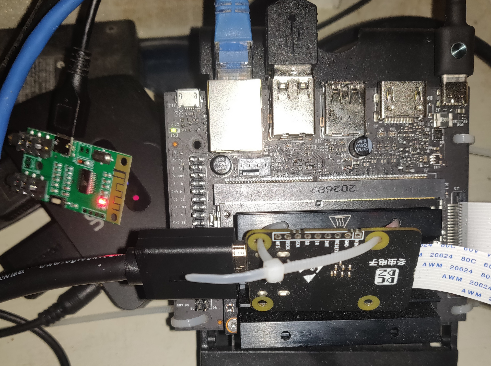

# tc358743-for-jetson-nano 2g
tc358743 for jetson nano for some taobao board  
driver & device tree demo for jetson nano 
1080p60 was worked  
the “冬虫电子” board has been tested.
## restriction  
can't changge resolution use v4l2ctr,resolution determined by input hardware.you should change on the input device or use gst(ffmpeg) to tranform to other resolution.  
the camera can't use,please reflash the orgine device tree.
i2s can't use,couse the hardware module some issue.   
other [reference](https://gist.github.com/nyacg/becd94a029355825a05f633f38a25b46)  
[ref2](https://forums.developer.nvidia.com/t/no-captured-data-from-v4l2-driver-tc358743/122615/118)

# hdmi2csi 模块在jeston nano 上的驱动和设备树。
支持分辨率1080P60，我只有冬虫的板子。其他廉价板可自行测试。
## 局限
不能修改分辨率，分辨率取决于视频设备的设置，也就是只能在视频端设置分辨率。软件端不能。至少v4l2软件不能直接处理。输出可以重编码处理。  
由于替换了相机设备树，所以相机模块不能使用。如要使用需要重刷原始设备树。或者自行修改设备树文件。  

国产版子i2s功能因为设计问题是不好用的。想用只能靠hdmi音频分离器分离出音频再用声卡采集。  

国产版子i2s功能因为设计问题是不好用。只能靠hdmi音频分离器分离出音频再采集。  
其他[参考](https://gist.github.com/nyacg/becd94a029355825a05f633f38a25b46)
[参考2](https://forums.developer.nvidia.com/t/no-captured-data-from-v4l2-driver-tc358743/122615/118)

  
  
